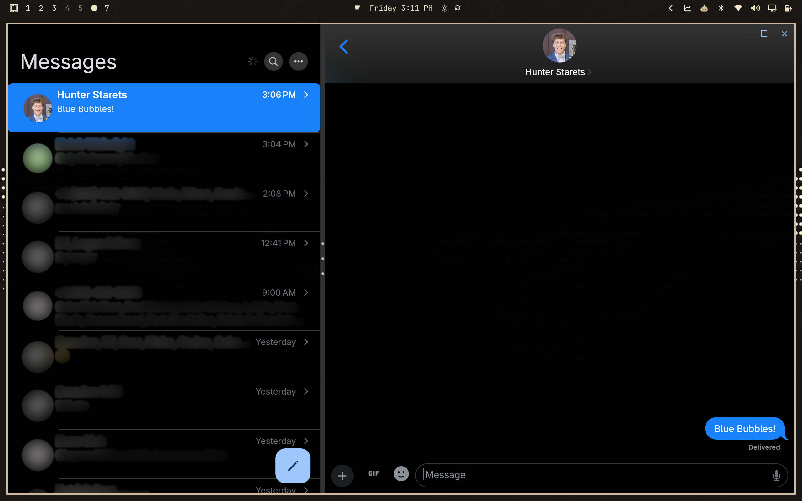
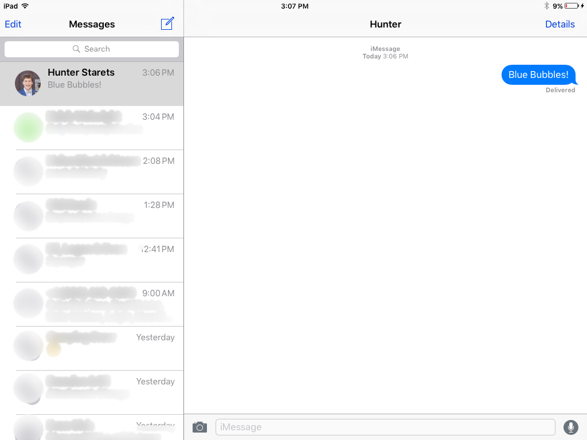
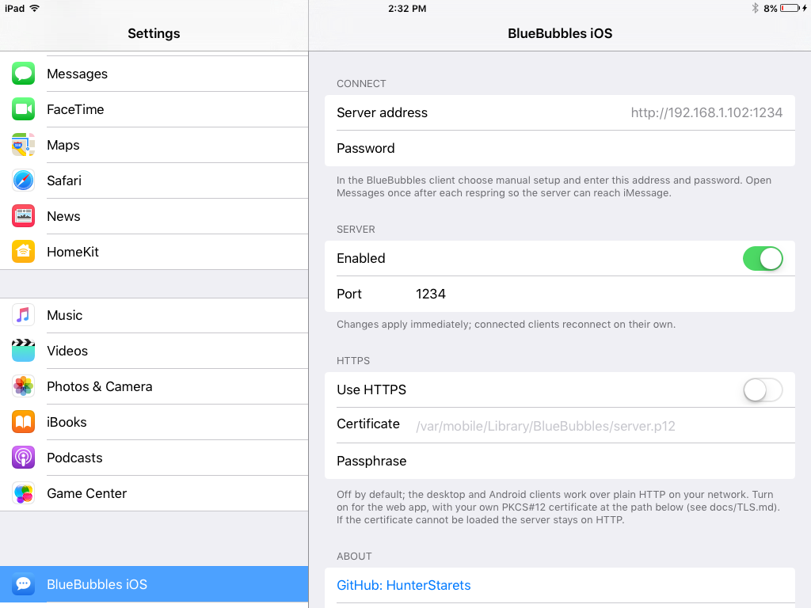
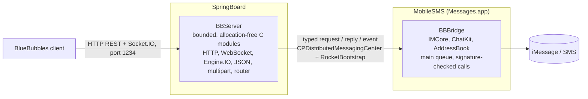

# BlueBubbles iOS

**An unofficial BlueBubbles server for jailbroken iOS 9.** It implements the
[BlueBubbles](https://bluebubbles.app) server API (REST `/api/v1` plus
Socket.IO) directly on the device, on top of iOS's private IMCore and ChatKit
frameworks, so the stock BlueBubbles desktop, Android, and web clients can
read and send the device's real iMessage and SMS conversations. No Mac, no
macOS server, no cloud component.

[](https://github.com/HunterStarets/bluebubbles-ios/actions/workflows/host-tests.yml)


[](LICENSE)

> Not affiliated with or endorsed by the BlueBubbles project. This is an
> independent implementation of their server contract.

<p align="center">
  
</p>
<p align="center">
  
  
</p>
<p align="center"><sub>Top: the desktop client talking to the iPad. Bottom: the same chat in Messages.app on iOS 9.3.5, and the Settings pane with the address and password the client needs.</sub></p>

## Contents

- [What it implements](#what-it-implements)
- [Status](#status)
- [How it works](#how-it-works)
- [Install](#install)
- [Building and testing](#building-and-testing)
- [Security](#security)
- [Roadmap](#roadmap)
- [Provenance and license](#provenance-and-license)

## What it implements

The subset of the BlueBubbles server contract the stock clients use in
normal operation, with the exact response schemas (`ChatResponse`,
`MessageResponse`, `HandleResponse`, `AttachmentResponse`), stable
identifiers, and Unix-millisecond dates the clients expect.

| Area | Routes and events | Notes |
|---|---|---|
| Startup | `GET /ping`, `GET /server/info`, `GET /fcm/client` | Advertises `server_version 0.2.0`, `private_api false`, so the client hides features iOS 9 lacks |
| Auth | `guid` / `password` / `token` query parameter | Constant-time comparison; one credential |
| Chats | `GET /chat/count`, `POST /chat/query`, `GET /chat/:guid`, `GET /chat/:guid/message`, `POST /chat/new` | Participants, last message, paging, date windows; new one-to-one chats with the first message |
| Messages | `GET /message/count`, `POST /message/query`, `GET /message/:guid`, `POST /message/text`, `POST /message/attachment` | Sends echo `tempGuid` so the client reconciles its optimistic bubble; attachments stream through a multipart reader to a staged file |
| Attachments | `GET /attachment/:guid`, `GET /attachment/:guid/download` | Raw bytes streamed from the transfer on disk |
| Contacts | `GET /contact`, `POST /contact/query` | Names, phones, emails, and base64 photo thumbnails from the device address book |
| Socket.IO | Engine.IO v4 / Socket.IO v5 over WebSocket and long-polling; `get-server-metadata`, `get-chats`, `get-chat`, `get-chat-messages`, `get-messages`, `get-attachment`, `start-chat` | ACK ids, heartbeat, server pushes |
| Pushes | `new-message`, `updated-message` | From ChatKit's own notifications inside Messages.app |

Anything iOS 9 cannot do (reactions, effects, edit, unsend, inline replies,
mentions, mixed text-and-attachment bubbles, Live Photos) is refused with a
`400` that names the limitation rather than faked. The route-by-route table,
including what is feasible but not yet built, is
[docs/COMPATIBILITY.md](docs/COMPATIBILITY.md).

## Status

`0.0.1`, first release. Verified end to end with the stock desktop client on
an iPad mini 1 running iOS 9.3.5: full sync of the device's conversations
and contacts, history with delivery and read state, text sends, attachment
sends (small image, 2 MB photo, audio file), and new-conversation creation.
Not yet in this release: marking chats read, typing indicators, group
management, deleting. See [CHANGELOG.md](CHANGELOG.md).

## How it works



Two dylibs, one per process, because the two halves have different needs:

- **SpringBoard** is always running, so it hosts the network server
  (`BBServer`). The protocol layer is a set of Foundation-free C modules in
  `common/`: an incremental HTTP/1.1 parser, RFC 6455 framing, Engine.IO and
  Socket.IO session state machines, a bounded JSON reader and writer, an
  incremental multipart reader, the router, per-connection state with
  pending (asynchronous) responses and body streaming, a request correlation
  table with timeouts and cancellation, and the response serializers. They
  allocate nothing, take caller-supplied buffers, reject on overflow rather
  than truncating, and run under AddressSanitizer in the host test suite.
  `BBServerTransport` owns the CFSocket listener, the CFStream pairs, the run
  loop tick, and the hand-off to the bridge.
- **Messages.app** is the only process where IMCore and ChatKit behave, so
  everything that reads or sends messages lives there (`BBBridge`), on the
  main thread. Every private selector is called through a
  `respondsToSelector:` plus `NSMethodSignature` check of its return and
  argument types, inside `@try/@catch`; a missing or differently typed
  selector degrades to an error reply, never a crash.
- The two talk over a small **typed IPC contract**: SpringBoard posts
  `{requestID, operation, argumentsJSON}`, the bridge answers
  `{requestID, status, dataJSON, ...}` or `{filePath, ...}` for large bodies,
  and pushes `{event, payloadJSON}` independently of any request. Replies
  larger than the connection buffer (contacts with avatars, attachment bytes)
  come back as private 0600 files the transport streams and unlinks; request
  bodies larger than it (attachment uploads) are streamed to a staged file as
  the multipart body arrives.

The armv7 toolchain for this SDK cannot link `memcpy`, `memset`, `strchr`,
`strlen`, `strcmp`, or any C++ runtime symbol into these dylibs, which is why
the C modules copy with `volatile` byte loops and the Objective-C never
assigns or block-captures large structs. Two audit scripts enforce that on
every build. Details: [docs/ARCHITECTURE.md](docs/ARCHITECTURE.md),
[docs/BUILDING.md](docs/BUILDING.md).

## Install

Requirements: a jailbroken device on iOS 9.0 to 9.3.5 (tested on an iPad
mini 1, armv7), with Mobile Substrate, RocketBootstrap, and PreferenceLoader
available from the default repos.

1. Download `com.hunterstarets.bluebubbles-ios_<version>_iphoneos-arm.deb`
   from the [latest release](../../releases/latest) and install it with
   Filza, or over SSH with `dpkg -i` followed by a respring.
2. Open **Settings → BlueBubbles iOS**. It shows the server address
   (`http://<device-ip>:1234`) and a password generated on first launch;
   change it if you like. Settings changes apply immediately.
3. In the BlueBubbles client choose manual setup, enter that address and
   password, and connect. The client performs its normal full sync.
4. Open **Messages.app** once after each respring: the half of the server
   that talks to iMessage lives inside it.

Plain HTTP on the LAN is the default, the same as the stock server. Remote
access works the way it does for the stock server, with a tunnel
(Cloudflare Tunnel, ngrok, zrok) on another machine on your network; optional
HTTPS with your own certificate is there for the web app on a LAN. See
[docs/INSTALL.md](docs/INSTALL.md), [docs/TLS.md](docs/TLS.md), and
[docs/TROUBLESHOOTING.md](docs/TROUBLESHOOTING.md).

## Building and testing

Theos with the iPhoneOS 9.3 SDK, targeting armv7:

```sh
export THEOS=~/theos
make clean package FINALPACKAGE=1
tools/audit-package.sh packages/*.deb   # payload layout, versions, forbidden imports
tools/audit-modules.sh                  # per-module lowering audit at -Os/-O2/-O3
```

Host tests need no device and no Theos:

```sh
cd tests
make check      # 9 C suites + Node fixture/contract tests
make sanitize   # the C suites under ASan/UBSan
```

`tests/bluebubbles-fixture-server.js` is a deterministic stand-in for this
server that speaks the same routes and schemas; the contract test drives it
through the stock client's startup sequence. `tests/live-bluebubbles-probe.js`
is a read-only probe for a real device that prints only schema-level facts
(status codes, counts, field types, timings), never message content or
addresses. [docs/TESTING.md](docs/TESTING.md) has the device procedure and
the manual send checks; [docs/RELEASING.md](docs/RELEASING.md) how a release
is cut.

## Security

- LAN only by default; the password is the only credential and rides in the
  query string exactly as it does with the stock server. Never expose port
  1234 directly to the internet; use a tunnel.
- Diagnostics are count-only by construction: the trace API takes an enum,
  so no message text, address, guid, or credential can enter a log.
- Attachment uploads are staged in `O_EXCL` 0600 files and deleted after the
  send is dispatched or on any failure; large replies are staged the same way
  and unlinked as soon as they are opened for streaming.
- Every buffer is bounded (16 KB heads, 64 KB buffered bodies, 20 MB
  uploads and downloads, 8 KB IPC arguments, 32-deep JSON), bytes that
  cannot start an HTTP request are refused at once, and idle connections are
  dropped.

Read [docs/SECURITY.md](docs/SECURITY.md) before exposing it beyond your
network.

## Roadmap

In rough order of value, all feasible on iOS 9: mark read/unread,
`message/count/updated` for incremental sync, typing indicators, group
rename and membership, fetching attachments the device has not downloaded,
blurhash placeholders. Reactions, effects, edit, unsend, replies, and
mentions are not possible on iOS 9 and will not be faked. The full list with
what each needs is in [docs/COMPATIBILITY.md](docs/COMPATIBILITY.md).

## Provenance and license

A clean-room implementation of the BlueBubbles server API against iOS 9's
private IMCore and ChatKit frameworks. The BlueBubbles client and server
sources were used as the protocol reference; no code from them or from any
other project is included. [MIT](LICENSE).
