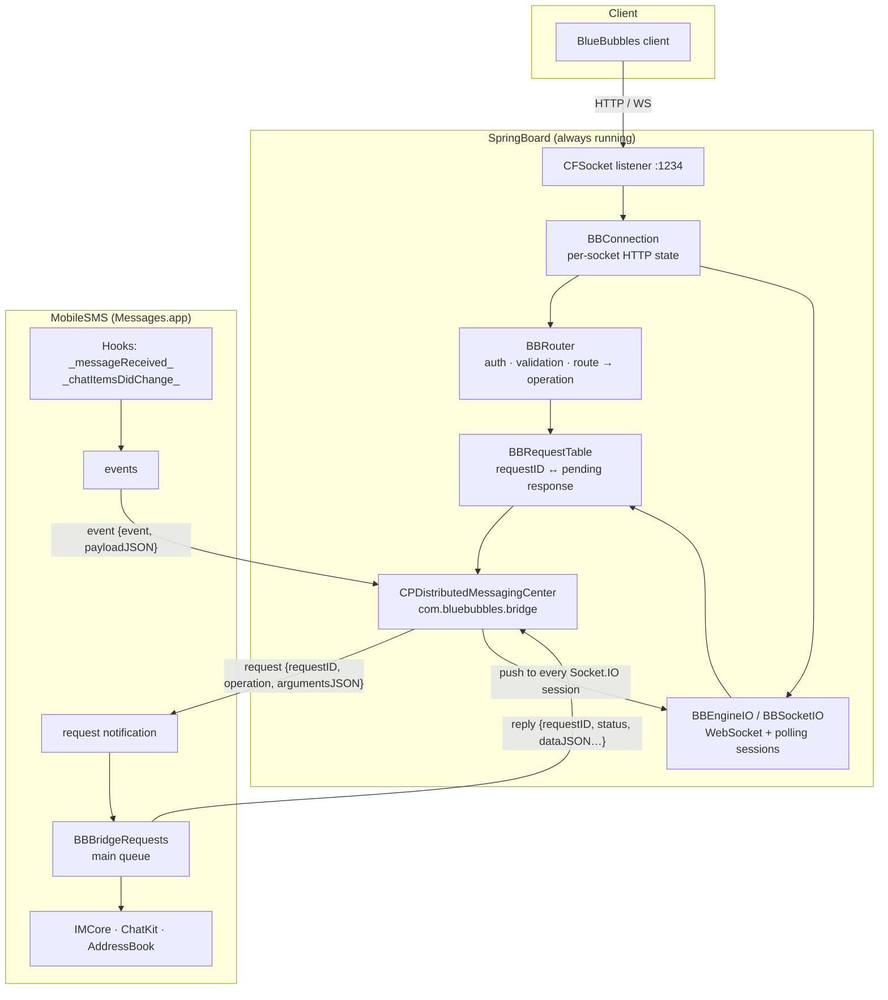

# Architecture

Two dylibs, one in each of the two processes that matter, talking over a
typed IPC contract.

## Why this split

SpringBoard is always running, so it hosts the network server. iMessage's
private frameworks (IMCore, ChatKit) only behave inside Messages.app, so
everything that reads or sends messages runs there, on its main thread. The
two halves are different processes with different rules, and the boundary
between them is a small, typed contract that can be tested on a host
machine without a device.

## SpringBoard side: `BBServer`

The network server is a set of **Foundation-free C modules** in `common/`
with headers in `include/`. They allocate nothing, take caller-supplied
buffers, and are compiled into host tests with sanitizers as well as into
the armv7 dylib:

| Module | Role |
|---|---|
| `BBHTTP` | Incremental HTTP/1.0–1.1 request parser: bounded head, Content-Length and chunked bodies, `headComplete` for streaming, query and percent decoding |
| `BBConnection` | Per-socket state machine: pipelining, keep-alive, pending (asynchronous) responses, upgrade hand-off, body streaming for uploads |
| `BBWebSocket` | RFC 6455 frames and the accept key |
| `BBEngineIO`, `BBSocketIO` | Engine.IO v4 / Socket.IO v5 sessions over WebSocket and long-polling: handshake, namespace connect, ACK ids, heartbeat, server pushes |
| `BBJSON` | Bounded JSON reader (offsets into the caller's buffer) and writer |
| `BBMultipart` | Incremental `multipart/form-data` reader that streams file parts |
| `BBResponse` | Envelopes (`{status, message, data, metadata, error}`) and response heads |
| `BBRouter` | Authentication (constant-time), every REST route and socket event, argument validation, and the mapping to bridge operations |
| `BBRequestTable` | Correlation of in-flight bridge requests to their HTTP connection or Socket.IO ACK; timeouts; cancellation on close |
| `BBEvents` | The allowlist of push events and broadcast to sessions |
| `BBSerialize` | The BlueBubbles response schemas (Chat, Message, Handle, Attachment, Contact) from plain C records; stable ids; Unix-ms dates |
| `BBTrace` | Count-only diagnostics |

`BBServer/BBServerTransport.xm` is the Objective-C owner: a CFSocket
listener and CFStream pairs on a dedicated thread, the run loop tick that
expires requests and heartbeats sessions, the IPC dispatch, download and
contact streaming from files, and the upload sink that stages attachments.

The connection scratch buffer is 256 KB and the input buffer 64 KB. Replies
larger than that (contacts with avatars, attachment bytes) come back from
the bridge as a **file path** that the transport streams and unlinks.
Request bodies larger than the input buffer (attachment uploads) are
**streamed**: the router claims the body, the multipart reader feeds the
file part to a private staged file as it arrives.

## MobileSMS side: `BBBridge`

`BBBridge/BBBridgeRequests.xm` implements every operation. Rules:

- Every private selector is called through a signature-checked dynamic
  call (`BBRQObject`, `BBRQObjectWithArgument`, …): missing or
  differently-typed selectors return nil instead of crashing.
- Everything runs on the main queue inside `@try/@catch`.
- Records are filled into the C structs `BBSerialize` understands, so the
  JSON shapes are host-tested and identical on both sides.
- Once a message has been sent, nothing afterwards may answer with an error
  (the client would retry and send twice); reply problems degrade to a
  data-less 200.

`BBBridge/Tweak.xm` connects to SpringBoard's messaging center and hooks
`CKConversationList _messageReceived:` and
`CKConversationListController _chatItemsDidChange:` to emit `new-message`
and `updated-message`.

## The IPC contract

Transport: CPDistributedMessagingCenter + RocketBootstrap. All values are
plist types; JSON travels as strings so the C layer can validate and pass it
through without Foundation.

**`request`** (SpringBoard → MobileSMS, as a distributed notification
`com.bluebubbles.bridge.request`):

| Key | Type | Meaning |
|---|---|---|
| `requestID` | string (decimal uint64) | Unique per request; seeded per process so ids never repeat across respring |
| `operation` | string ≤ 31 bytes | One of the operations below |
| `argumentsJSON` | string ≤ 8191 bytes | A JSON object built by `BBRouter` |

**`reply`** (MobileSMS → SpringBoard, message on the center):

| Key | Type | Meaning |
|---|---|---|
| `requestID` | string | Copied from the request; unknown or completed ids are ignored |
| `status` | number | HTTP-style status |
| `message` | string | Envelope `message` |
| `dataJSON`, `metadataJSON`, `errorJSON` | string, optional | Raw JSON for the envelope fields; validated before use |
| `filePath`, `contentType`, `ephemeral` | alternative | A file to stream as the body (downloads, large replies); `ephemeral` files are unlinked after open |

**`event`** (MobileSMS → SpringBoard): `{event, payloadJSON}`. Never matched
against the request table; broadcast to every connected Socket.IO session.
Allowed names: `new-message`, `updated-message`, `message-send-error`,
`chat-read-status-changed`, `hello-world`.

**Operations**

| Operation | Arguments | Reply data |
|---|---|---|
| `chat.count` | `{includeArchived}` | `{total, breakdown:{iMessage, SMS}}` |
| `chat.query` | `{withParticipants, withLastMessage, withArchived, withSMS, sort, offset, limit}` | `ChatResponse[]` + paging metadata |
| `chat.get` | `{guid, withParticipants, withLastMessage}` | `ChatResponse` |
| `chat.messages` | `{guid, withAttachments, withHandle, sort, after, before, offset, limit}` | `MessageResponse[]` + metadata |
| `chat.new` | `{addresses[], service, message, tempGuid}` | `ChatResponse` with `messages:[sent]` |
| `message.count` | `{chatGuid, after, before}` | `{total}` |
| `message.query` | `{chatGuid, withChats, withChatParticipants, withAttachments, withHandle, sort, after, before, offset, limit}` | `MessageResponse[]` + metadata |
| `message.get` | `{guid, withChats, withAttachments, withHandle}` | `MessageResponse` |
| `message.send` | `{chatGuid, message, tempGuid}` | `MessageResponse` echoing `tempGuid` |
| `message.attachment` | `{chatGuid, tempGuid, name, contentType, uploadPath, bytes}` | `MessageResponse` with `attachments`; the bridge deletes `uploadPath` |
| `attachment.get` | `{guid}` | `AttachmentResponse` |
| `attachment.download` | `{guid}` | file reply |
| `contact.query` | `{}` | `ContactResponse[]` (file-staged when large) |

Correlation rules: a request claims a table slot (`503 Too many pending
requests` when full); HTTP requests are dispatched once the connection is
in the pending state, socket requests immediately; replies complete the
right origin; requests older than 30 s complete with `504`; closing a
connection or session cancels its requests and late replies are dropped.

## Guids and identifiers

Chat guids follow the BlueBubbles form `iMessage;-;+15555550100` (direct)
and `iMessage;+;chat123…` (group), taken from the IMChat when it has one
and composed otherwise. `originalROWID` values are stable FNV-1a hashes of
the guid/address, never zero. A chat that ChatKit does not list yet (just
created, no message) still resolves by its identifier through
`conversationForExistingChatWithGroupID:`.

## Diagnostics

`bb_trace` appends `build=<version> pid=… time=… event=<fixed-name>` to
`/tmp/bbdiag-sb.log` and `/tmp/bbdiag-sms.log` (mode 0600, capped at 64 KB,
never following links). There is no way to put a payload, address, guid, or
credential into a trace line.
